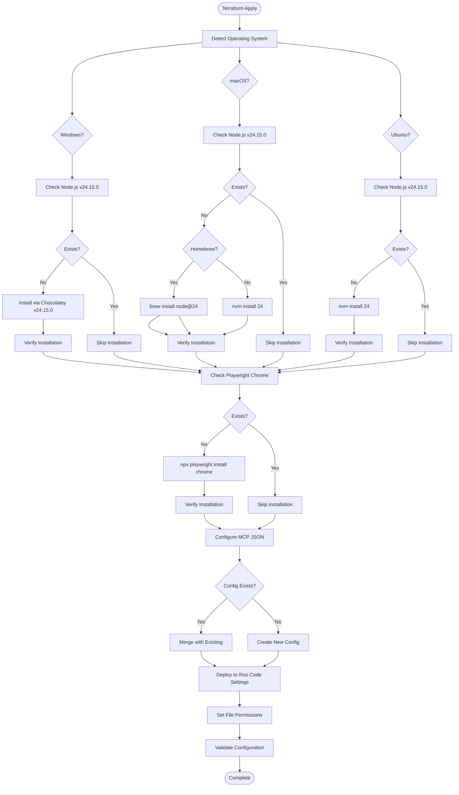
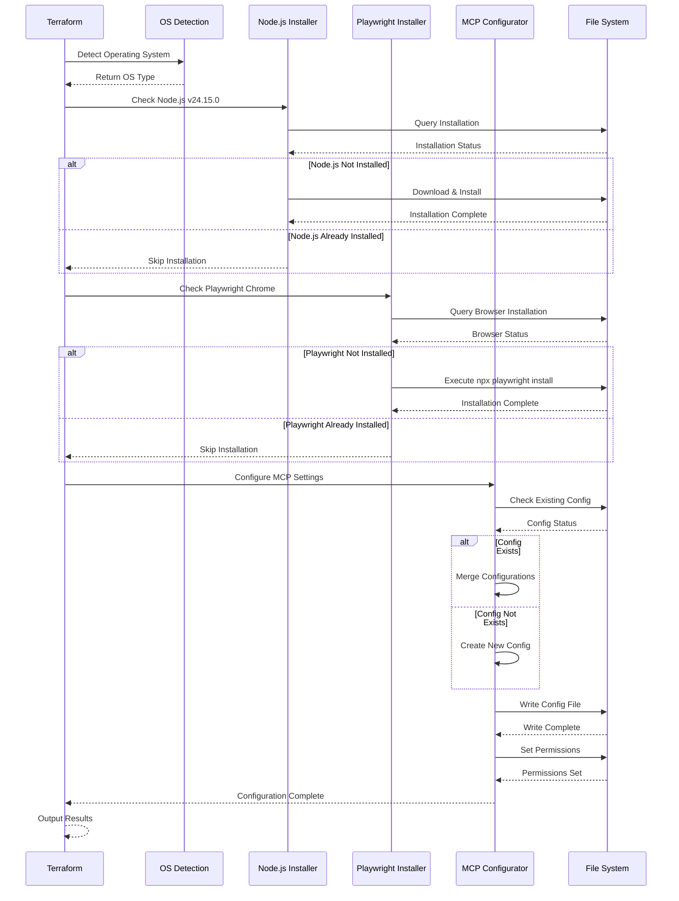
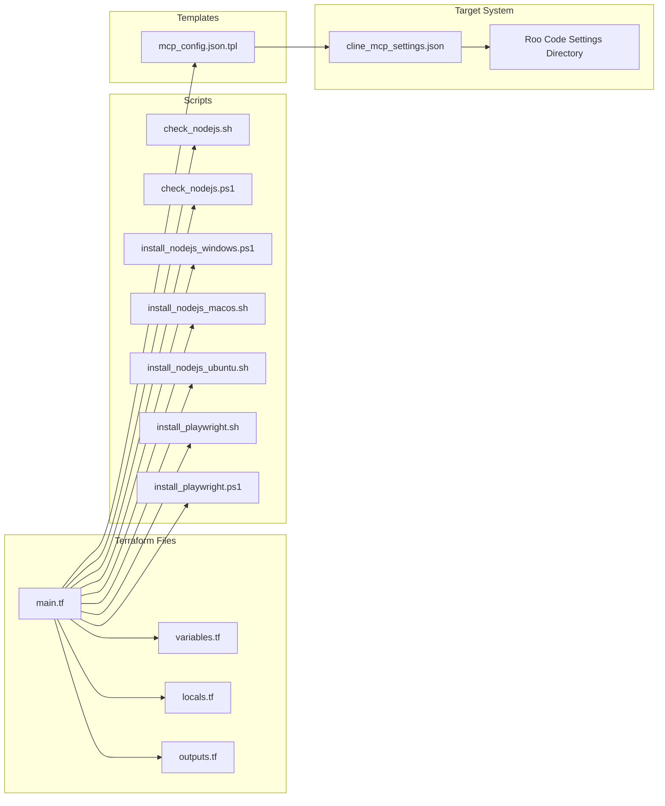
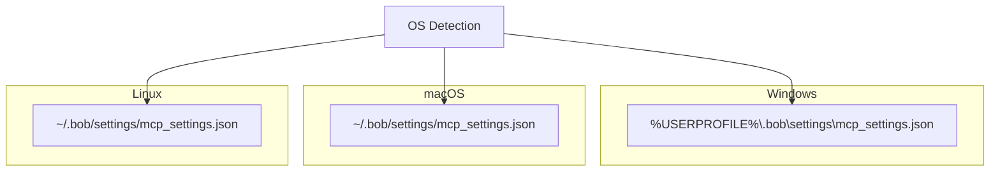
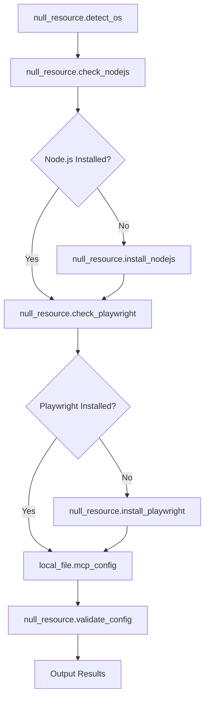
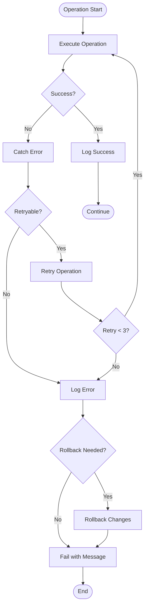

# Terraform Playwright MCP - Architecture Overview

**Target IDE:** IBM Bob
**Node.js Version:** v24.15.0
**Playwright Browser:** Chrome only
**Configuration Path:** `~/.bob/settings/mcp_settings.json`

## System Architecture Diagram

## Component Interaction Flow

## File Structure and Dependencies

## OS-Specific Configuration Paths

## Resource Dependencies

## Error Handling Strategy

## Key Design Principles

1. **Idempotency**: All operations can be safely repeated
2. **Cross-Platform**: Single codebase works on Windows, macOS, and Ubuntu
3. **Fail-Safe**: Graceful error handling with clear messages
4. **Modular**: Separate concerns into distinct scripts and modules
5. **Declarative**: Terraform manages state and dependencies
6. **Validation**: Each step validates before proceeding

## Security Considerations

- HTTPS downloads only
- Checksum verification where available
- Minimal privilege execution
- Secure file permissions on config files
- No hardcoded credentials
- Input validation on all parameters